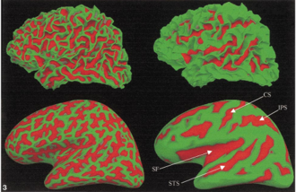
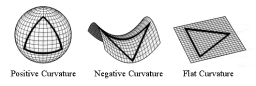
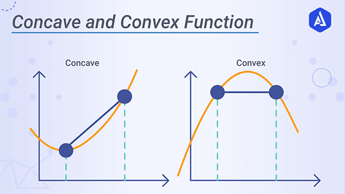

# Mindboggle7T
A pipeline for Morphometric studies in 7T. Ideal for 3D shapes and Volumetry. Double processing of T1 images in SPM12+Freesurfer and in ANTs for a Hybrid Segmentation fed to Mindboggle.

**EXTRA**: for a Docker Mini-Guide check the appropriate attached file

# Morphometry Pipeline:
## Mindboggle (SPM12-Fressurfer+ ANTs) pipeline
>[Alessandro De Maio: demaio.1695400@studenti.uniroma1.it]

____
## In Brief:

This pipeline is specifically made for **7T images**.
On 3T images, the initial SPM bias field correction may not be necessary, since N4 from ANTs and N3 from Freesurfer are applied automatically.

### Main Advantages of using this pipeline for Morphometric studies:
- cross-template and crosssoftware brain image hybridization
- new formulas for 3D shapes and 2D morphometry parameters

### Inputs:
- T1 image
(tested on T1 3D TFE at 0.8* 0.8* 0.8mm resolution)

### Outputs:
- For each Gyrus MRI label:
  - volume
- For each Gyrus and Sulcus surface label:
  - surface area
  - travel depth
  - geodesic depth
  - mean curvature
  - convexity (from FreeSurfer)
  - thickness (from FreeSurfer)

___
### General Overview of  Automatic Data processing (done automatically by Mindboggle):
1. Create hybrid gray/white segmentation from FreeSurfer and ANTs output (combine_2labels_in_2volumes).
2. Fill hybrid segmentation with FreeSurfer- or ANTs-registered labels.
3. Compute volume shape measures for each labeled region:
   - volume (volume_per_brain_region)
4. Compute surface shape measures for every cortical mesh vertex:
   - surface area
   - travel depth
   - geodesic depth
   - mean curvature
   - convexity (from FreeSurfer)
   - thickness (from FreeSurfer)
5. Extract cortical surface features:
   - folds
   - sulci
   - fundi
6. For each cortical surface label/sulcus, compute:
  - area
  - mean coordinates: means_per_label
  - mean coordinates in MNI152 space
  - Laplace-Beltrami spectrum
  - Zernike moments
11. Compute statistics (stats_per_label in compute.py) for each shape measure in #4 for each label/feature:
  - median
  - median absolute deviation
  - mean
  - standard deviation
  - skew
  - kurtosis
  - lower quartile
  - upper quartile

____
### Atlas used for structure identification:
- DKT atlas (Mindboggle101 data)

https://mindboggle.readthedocs.io/en/latest/labels.html

Klein, A., & Tourville, J. (2012). 101 Labeled Brain Images and a Consistent Human Cortical Labeling Protocol. Frontiers in Neuroscience, https://doi.org/10.3389/fnins.2012.00171
https://mindboggle.readthedocs.io/en/latest/labels.html

___
# Docs

### Mindboggle paper:
1. https://osf.io/nhtur/
2. Klein A, (2012),  101 labeled brain images and a consistent human cortical labeling protocol. Front Neurosci http://dx.doi.org/10.3389/ fnins.2012.00171
3. Klein Arno (2016). Mindboggle-101 manually labeled individual brains [Internet]. Harvard Dataversehttp://dx.doi.org/10.7910/DVN/HMQKCK

### The SPM bias field correction has specific parameters found from literature:

1. Uwano, I. (2014). Intensity inhomogeneity correction for magnetic resonance imaging of human brain at 7T. Medical Physics, 41(2), 22302. https://doi.org/10.1118/1.4860954
2. Ganzetti, M (2015). Quantitative Evaluation of Intensity Inhomogeneity Correction Methods for Structural MR Brain Images. Neuroinformatics, 14(1), 5–21. https://doi.org/10.1007/s12021-015-9277-2
3. Ganzetti, M (2016). Intensity Inhomogeneity Correction of Structural MR Images: A Data-Driven Approach to Define Input Algorithm Parameters. Frontiers in Neuroinformatics, 10. https://doi.org/10.3389/fninf.2016.00010
4. Ewert, S (2019). Optimization and comparative evaluation of nonlinear deformation algorithms for atlas-based segmentation of DBS target nuclei. NeuroImage, 184, 586–598. https://doi.org/10.1016/j.neuroimage.2018.09.061
5. Edlow, B (2019). Metadata record for: 7 Tesla MRI of the ex vivo human brain at 100 micron resolution [Data set]. figshare. https://doi.org/10.6084/M9.FIGSHARE.9958688

### Mathematical details of selected extracted parameters:

- **Travel Depth**: Depth from most superficial point of gyrus GM to deepest point of gyrus GM in the sulcus-fold (different from thickness)
- **Geodesic depth**: typically less used and less acccurate measure of depth, as compared with Travel Depth
- **Convexity** and **Curvature**
  -  (from Freesurfer website) The average convexity is useful for quantifying the folding pattern of a surface, as C captures large-scale geometric features, while being relatively insensitive to the small folds that typically occur on the banks of a sulcus. This is in contrast to mean curvature which attains equally high values for small secondary and tertiary folds in a surface as for the primary folds. The Figure illustrates this difference between the mean curvature of the folded cortex (left) and the average convexity as quantified by C (right), painted onto both the gray/white matter (top), and inflated (bottom) surfaces. Note how accurately the average convexity represents only the primary folding patterns. The major anatomical features of this surface, such as the central sulcus (CS), superior temporal sulcus (STS), intraparietal sulcus (IPS), and sylvian fissure (SF), are clearly visible, while the secondary and tertiary folding patterns apparent in the mean curvature are largely absent.
  - Other Maths overview:  
- **Laplace-Beltrami spectrum** and **Zernike moments**: shape-related (as from 3D generated sulci and/or gyrus labels) specific PCA components. Provide for a poorly defined use in Neuroimaging and Morphometric-Geometric studies

____
# Output Folders Structure:

### Freesurfer:
- **fsaverage**: this just links to the original installation folder images that Freesurfer needs for averaging and MNI, templates...
- **ID**: this is the main FS folder and it will be defined at the flag "-subjid ID"
-**scripts**: scripts and logs => check recon-all.stats.log and check the last line
- **mri**: MRI-based partial in-progress outputs
- **labels**: different parcellation masks => open in Freeview (check tutorial first: https://surfer.nmr.mgh.harvard.edu/fswiki/FsTutorial/ControlPoints_freeview/)
- **surf**: 3D extracted output. For Visual check: look in freeview lh.pial, lh.white, rh.white, rh.pial on top of the MRI image using Freeview

### Mindboggle
https://mindboggle.readthedocs.io/en/latest/#visualize-output
- **working**: working directory of mindboggle
- **shapes**, **features** and **labels**: here different .vtk files are generated (for 3D visual) in different folders based on which data they were extracted (eg. curv.vtk is a 3D brain image with the curvature output data reported for each vertex). The "label" folder includes also 2 .nii-files  which gives the numbering of ANTs and Freesurfer based template-labels on the mindboggle hybrid
- **tables**: main output tables from mindboggle:
  - _volumeperants_label.csv_ and _volumeperfreesurfer.csv_ => These are volumetric outputs with template-labelling based either on ANTs or FS labels on the mindboggle hybrid
  - _label_shapes.csv_: per-label (per-gyrus) surface shape statistics per labels on the hybrid based on the DKT atlas
  - _sulcus_shapes.csv_: per-sulcus surface shape statistics per labels on the hybrid based on the DKT atlas
  - _fundus_shapes.csv_: per-fundus surface shape statistics (under evaluation at the Mindboggle GitHub page)
  - _vertices.csv_: per-vertex (in 3D brain shape) surface statistics (not to be used for final outputs, but can be for visualization purposes on softwares like Paraview)

___
# Full Pipeline Outline

1. Gunzip -> SPM12 -> Freesurfer (FS) -> Visual QC
2. ANTs Corticalthickness.sh -> Visual QC
3. Join outputs from FS and ANTs into Mindboggle -> Visual QC
4. Organize table outputs and brain areas according to legend

(Suggested: use nohup for every command)

___
# Pipeline in detail
___
## Part1

### 1a) Gunzip
Extract base T1 image (*.nii.gz) into *.nii, since SPM12 accepts only *.nii files

### 1b) SPM12
SPM12 "New Segment"
- Sampling distance 2
- FWHM 18
- Regularization 0.001

### 1c) Freesurfer
Run command:
`nohup recon-all -all -hires -subjid [specify a name for the subject, the "sd folder" will have a so-named sub-folder] -i [T1 image] -sd [output folder] -parallel > nohup_recon-all.txt`
- -hires is needed for resolution <1mm, beware of updates on <0.7mm
- -all will run all three autorecon1, autorecon2, autorecon3 steps
- -parallel will ditribute the work multithreading

### 1d) Visual QC
May over/under-estimate brain slightly, but can be corrected in Mindboggle

### 1e) In case of misalignment or faulty brain segmentation: check for Control Points correction in Freesurfer
Manual correction can be done either in ANTS or FS, but systematically FS tends to underestimate the segmentation, whereas ANTs overestimate; hence better to include brain areas cut-out, also in FS is easier and faster with more control.
Steps:
- manual Control Point selection
- copy and replace the edited mask
- `recon-all -autorecon2-cp -autorecon3 -subjid [subject ID chosen] ` _or_ `run  recon-all -autorecon2 -autorecon3 -subjid [subject ID chosen]`

___
## Part2

### 2a, 2b) ANTs Corticalthickness (N4+ Brain Segmentation+ Corticalthickness)
Run pipeline on base T1 image *.nii.gz file directly.
**Corticalthickness.sh** will automatically run N4 for Intensity non-Uniformity correction iteratively and ultimately run brain extraction plus cortical thickness computations
(Corticalthickness.sh is not directly used for its thickness table output, but used for brain masking and GM/ WM segmentation for confrontation and hybridization at step3)
- Run:
`antsCorticalThickness.sh -d 3 -a [T1 input image] -o [output folder desired] -e /opt/data/OASIS-30_Atropos_template/T_template0.nii.gz -t /opt/data/OASIS-30_Atropos_template/T_template0_BrainCerebellum.nii.gz -m /opt/data/OASIS-30_Atropos_template/T_template0_BrainCerebellumProbabilityMask.nii.gz -f /opt/data/OASIS-30_Atropos_template/T_template0_BrainCerebellumExtractionMask.nii.gz -p /opt/data/OASIS-30_Atropos_template/Priors2/priors%d.nii.gz -u 0`

_generally speaking only two options need to be changed here (input image and output folder), since the other flags recall specific template files for the script to run and also follows specific iterative commands already paper-approved optimized for general use_

### 2c) Visual QC
May under/over-estimate brain slightly, but be corrected in Mindboggle

___
## Part3

### 3a) ASCII problem prevention and Variable selection
-This exporting step is important otherwise mindboggle may crash, so update every time for every subject
- `locale-gen en_US.UTF-8`
- `export LANG=en_US.UTF-8 LANGUAGE=en_US.en LC_ALL=en_US.UTF-8`
- `export ANTS_SUBJECT= [ANTsBrainSegmentation.nii.gz file, inside the main ANTs folder]`
- `export FREESURFER_SUBJECT= [FS output folder]`
- `export OUT= [output folder]`

### 3b) Run Mindboggle
`nohup mindboggle [FREESURFER_SUBJECT] --ants [ANTS_SUBJECT] -out [OUT] > nohup_MB.txt`

_-If ANTs was not run earlier, Mindboggle can still be run, but no hybridization will take place, hence it will re-analyse Freesurfer-output images with the new formulas (present in Mindboggle)_
